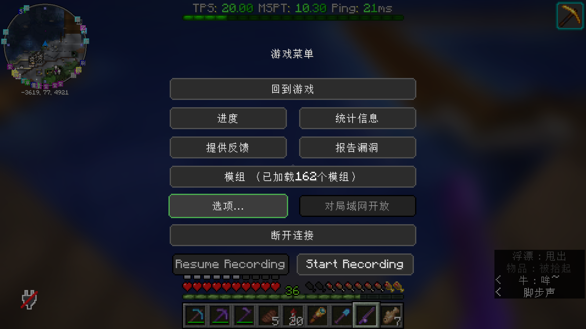
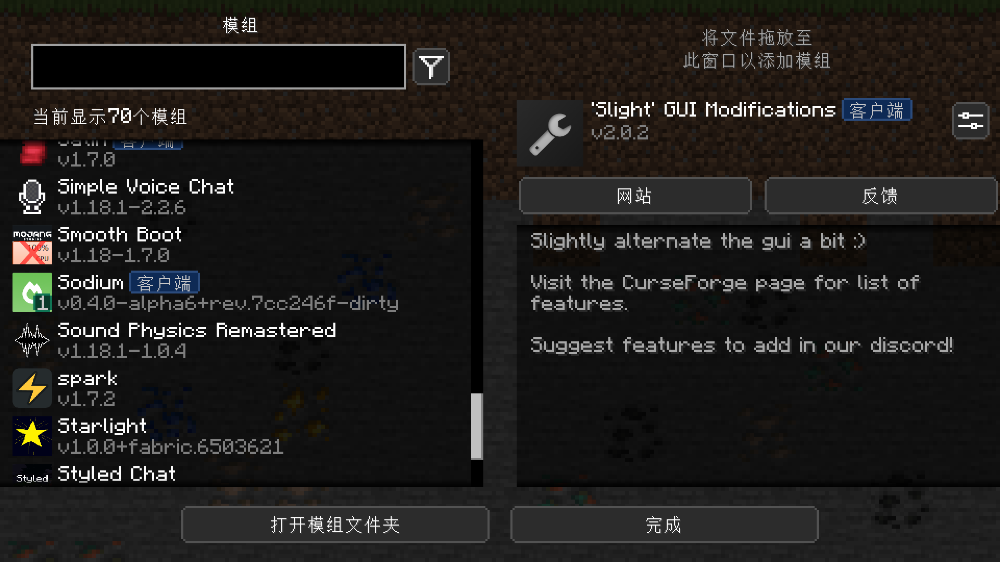
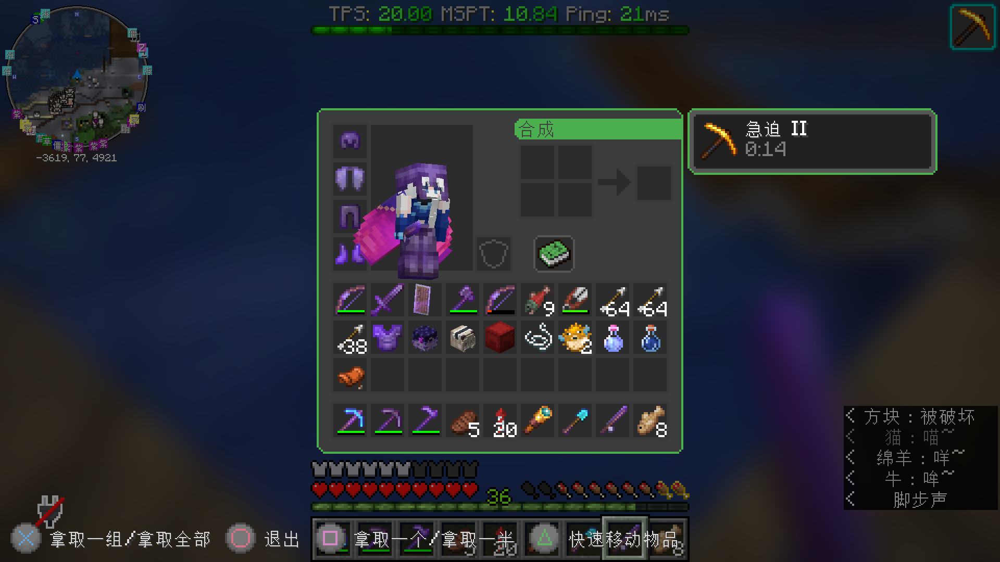

# xmzs-resources
夏沫之诗服务器资源包

本资源包集成了以下内容，以提供更好的服务器体验：
* [Gamemode4资源包](https://github.com/Gamemode4Dev/GM4_Resources)
    * 目前只集成了部分翻译，翻译由服务器团队自行完成
* [基岩版特殊符号](assets/xmzs/textures/bedrock_glyphs/)
    * 来源于Minecraft基岩版内置资源包
* 资源包封面字体来源于[这里](https://www.lexaloffle.com/bbs/?tid=3760)
* [来自AmberWat的NegativeSpaceFont](https://github.com/AmberWat/NegativeSpaceFont)
    * 我们作出了以下这些修改：
        * 移除`assets/minecraft/font`目录，避免在游戏内通过正常聊天等方式使用相关功能
        * pack_empty中为了尽可能缩减压缩包大小，只在lang中保留了`space.-36`
* [DartCat25](https://www.planetminecraft.com/member/dartcat25/)的[Menus - Enchanted](https://www.planetminecraft.com/texture-pack/menus-enchanted/)
    * 没有作出任何修改
* [Re:ゼロから始める異世界生活](http://re-zero-anime.jp/)
    * player.respawn.1 的音效截取自 Re:ゼロから始める異世界生活 スペシャルサウンドトラック 1 魔女の呼び声
    * player.respawn.2 的音效截取自 Re:ゼロから始める異世界生活TVアニメーション
    * 以上版权所有：©長月達平・株式会社KADOKAWA刊／Re:ゼロから始める異世界生活製作委員会

## 资源包特殊符号用法

要打出某个符号，只需要先确定位置，然后分别获得其所在行、列最开始的数字a、b，接着通过相关工具获得`\uE<a><b>`所对应字符，在游戏内粘贴即可。

例如，在游戏内打出**三叉戟**符号的步骤如下：
1. 首先，在[表格](pack_xmzs-resources/assets/minecraft/font/glyph_map.webp)内找到三叉戟，它位于第4行第5列。
2. 接着，向左看，找到那一行最开始的数字 `23`
3. 然后，向上看，找到那一列最开始的数字 `5`
4. 将对应的字符转换并输入到游戏中即可
    * Linux(GNOME桌面环境)：打开gedit，按下`[Ctrl]`+`[Shift]`+`U`，然后依次输入`E`、`2`、`3`、`5`、`[空格]`，复制输出到游戏中粘贴。
    * Windows：上网搜索`unicode 中文 转换`找到相关工具，复制`\uE235`的转换结果到游戏中粘贴。

## 屏幕截图

## 源文件目录结构
* 所有源文件应保存在"src_xxx"目录中，由构建脚本生成完整资源包"pack_xxx"
* 各资源包src目录下的"main"仅用于存放本体，不包含来自其他资源包的文件。
* 若要集成其他资源包，需放在src下的"ext_xxx"目录中
* *overlayer目录用于存放TextureOverlayer需要使用的文件*